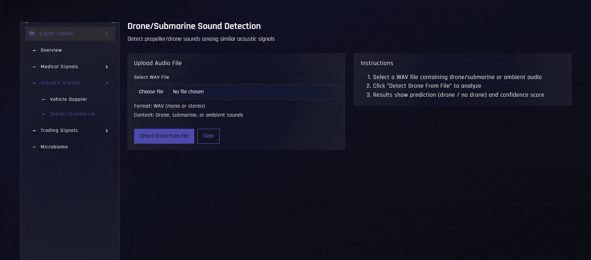

# Signal Viewer — SBEG205 Task 01

### Team 16 — Biomedical Signal Processing & AI Platform

---

## Full Application Demo


---

# Overview

Signal Viewer is a full-stack biomedical signal visualization and analysis platform integrating:

- **Deep Learning models** (ECG PTBCNN, EEG Biot, Drone CNN)
- **Classic statistical & signal processing** (RR stats, autocorrelation, pNN50, DSP-based detection)
- **Interactive signal visualization** (multi-channel displays, recurrence plots, polar views)
- **Real-time acoustic simulation** (Doppler generation and estimation)
- **Financial signal & microbiome profiling** (trading charts, taxonomic abundance)

The system supports ECG, EEG, Doppler estimation, drone/submarine audio detection, financial signals (stocks, currency, minerals), and microbiome profiling through a modern web interface.

---

# Feature Demonstrations

## ECG Viewer — AI vs Classic ML


### Capabilities

- 12-lead ECG visualization (PTB Diagnostic dataset, WFDB format)
- **Visualization modes:** Continuous, XOR channel interaction, Polar representation, Recurrence plots
- **AI diagnosis** using PTBCNN (morphology-based: MI, BBB, cardiomyopathy, etc.)
- **Classic ML rhythm analysis** (RR statistics, autocorrelation, pNN50 → normal, bradycardia, tachycardia, irregular)
- Side-by-side AI vs statistical comparison
- Segment selection and record listing

---

## EEG Viewer


### Capabilities

- **AI prediction** via Biot EEG model (Kaggle dataset, streamed from remote)
- **Visualization modes:**
  - Continuous multi-channel display
  - XOR channel interaction view
  - Polar representation
  - Recurrence plots
- File listing and streaming from Kaggle EEG dataset
- Sample rate handling and channel reshaping

---

## Vehicle Doppler Simulation


### Physics Model

```
f' = f₀ × (c / (c − vᵣ))
```

Where:
- **f₀** = base horn frequency (Hz)
- **c** = speed of sound (m/s)
- **vᵣ** = relative velocity of the source

### Capabilities

- **Generate** Doppler WAV audio (velocity, frequency, duration, sample rate)
- **Estimate** Doppler shift from pass-by recordings (WAV, FLAC, OGG)
- Returns estimated v (m/s), v (km/h), and frequencies (fa, fr, f₀)

---

## Drone / Submarine Detection



### Workflow

- Upload WAV file
- Spectrogram generation
- **ML path:** CNN classification (Drone vs Non-Drone) when `drone_detector` model is available
- **DSP fallback:** Band energy ratio, spectral centroid when ML model is missing
- Returns `prediction`, `confidence`, and optional feature debug

---

## Trading Signal Visualization


### Capabilities

- **Stock price charts** — historical stock data
- **Currency exchange** — forex data visualization
- **Gold & mineral prices** — merged v1/v2 datasets
- Interactive ECharts dashboard
- Data from `backend/data/{stock,currency,minerals}/`

---

## Microbiome Profiling


### Capabilities

- **Patient listing** — list patient IDs from microbiome samples
- **Abundance over time** — top taxa abundance by week for selected patient
- **Patient composition** — pie chart and top taxa at latest time point
- Data from `backend/data/Microbiome/patients_csv/` (one CSV per patient)

---

# System Architecture

## Frontend

| Technology | Purpose |
|------------|---------|
| Next.js 14 | App Router, SSR |
| React 18 | UI components |
| Bootstrap | Styling |
| Redux | State management |
| Apache ECharts | Charts (ECG, trading, microbiome) |
| FilePond | File upload (drone, Doppler) |

## Backend

| Technology | Purpose |
|------------|---------|
| FastAPI | REST API |
| Uvicorn | ASGI server |

## Machine Learning

| Technology | Domain |
|------------|--------|
| PyTorch | ECG (PTBCNN), EEG (Biot) |
| TensorFlow/Keras | Drone CNN |
| WFDB | ECG I/O (PTB Diagnostic) |
| Librosa | Audio loading, spectrograms |
| scikit-learn | Classic ML (RR stats, autocorrelation) |
| NumPy, SciPy | Signal processing |

---

# Project Structure

```
task01-signal-viewer-sbeg205_spring26_team16/
├── backend/                    # FastAPI REST API & ML services
│   ├── app/
│   │   ├── main.py             # FastAPI app, CORS, route registration
│   │   ├── core/
│   │   │   └── config.py       # ECG_DATASET_DIR, PTB_FULL_DATASET_DIR, MICROBIOME_DATA_DIR
│   │   ├── routers/
│   │   │   ├── ecg_router.py   # /ecg/* — records, predict, classic-ml
│   │   │   ├── acoustic_router.py  # /acoustic/* — doppler/generate, doppler/estimate, drone/detect
│   │   │   ├── eeg_router.py   # /eeg/* — predicteeg, list-files, stream
│   │   │   ├── gold_router.py  # /gold/* — currency, minerals, stock
│   │   │   └── microbiome_router.py # /microbiome/* — patients, abundance-over-time, patient-composition
│   │   ├── services/
│   │   │   ├── ecg_service.py          # ECG record listing, segment fetch
│   │   │   ├── classic_ml_ecg_service.py  # RR stats, autocorrelation, pNN50
│   │   │   ├── acoustic_service.py    # Doppler estimation, generation, drone DSP
│   │   │   ├── drone_ml_service.py    # Drone CNN inference (drone_detector)
│   │   │   ├── wfdb_loader.py         # WFDB record loading
│   │   │   ├── gold_service.py        # Stock, currency, minerals data
│   │   │   └── microbiome_service.py  # Patient data, abundance, composition
│   │   └── ML/
│   │       ├── ecg/
│   │       │   ├── model.py       # PTBCNN architecture
│   │       │   ├── predictor.py   # Inference on 12-lead ECG
│   │       │   ├── ptb_dataset.py # PTB data loader
│   │       │   ├── train_ptb.py   # Training script
│   │       │   ├── labels.json    # Class names
│   │       │   ├── ptb_weights.pt # Trained weights
│   │       │   └── splits.json    # Train/val/test split
│   │       └── eeg/
│   │           ├── model.py       # Biot EEG architecture
│   │           └── predictor.py   # Inference on EEG arrays
│   ├── data/
│   │   ├── ecg/ptbdb/            # PTB Diagnostic ECG records (WFDB)
│   │   ├── currency/             # Currency exchange CSV
│   │   ├── minerals/             # Gold/minerals CSV
│   │   ├── stock/                # Stock price CSV
│   │   └── Microbiome/           # patients_csv/*.csv per patient
│   └── requirements.txt
│
├── frontend/                     # Next.js React application
│   ├── app/
│   │   ├── layout.js
│   │   ├── api/                  # API routes
│   │   └── (components)/(contentlayout)/
│   │       ├── layout.js
│   │       ├── page.js           # Overview
│   │       └── signal-viewer/
│   │           ├── page.js       # Signal viewer hub
│   │           ├── medical/
│   │           │   ├── ecg/page.js     # ECG Viewer
│   │           │   └── eeg/page.js     # EEG Viewer
│   │           ├── acoustic/
│   │           │   ├── doppler/page.js # Vehicle Doppler
│   │           │   └── drones/page.js  # Drone Detection
│   │           ├── trading/
│   │           │   ├── stocks/page.js
│   │           │   ├── currencies/page.js
│   │           │   └── minerals/page.js
│   │           └── microbiome/page.js
│   ├── shared/
│   │   ├── components/signal-viewer/
│   │   │   ├── ContinuousViewer.js
│   │   │   ├── XORViewer.js
│   │   │   ├── PolarViewer.js
│   │   │   └── RecurrenceViewer.js
│   │   ├── data/signal-viewer/
│   │   │   ├── dopplerData.js
│   │   │   ├── arrhythmiaDetection.js
│   │   │   ├── tradingData.js
│   │   │   └── microbiomeData.js
│   │   ├── layout-components/
│   │   ├── constants/
│   │   └── utils/
│   ├── public/
│   └── package.json
│
├── drone_detector/               # Standalone drone CNN (Keras/TensorFlow)
│   ├── drone_detector.h5         # Trained model
│   └── labels.npy                # Class labels
│
├── docs/
│   ├── gifs/                     # Demo screenshots
│   └── PROJECT_STRUCTURE.md
│
└── README.md
```

---

# Installation

## Prerequisites

- **Node.js** 18+ and npm
- **Python** 3.10+
- **PTB Diagnostic ECG dataset** (optional, for full ECG training)
- **Kaggle credentials** (for EEG streaming — configured in `eeg_router.py`)

## Clone Repository

```bash
git clone <repo-url>
cd task01-signal-viewer-sbeg205_spring26_team16
```

## Backend

```bash
cd backend
pip install -r requirements.txt
python -m uvicorn app.main:app --reload --port 8001
```

## Frontend

```bash
cd frontend
npm install
npm run dev
```

Open: **http://localhost:3000**

## Configuration

### Backend

- **ECG:** Place PTB records in `backend/data/ecg/ptbdb/`
- **ECG training:** Set `PTB_FULL_DATASET_DIR` (env or `config.py`)
- **Drone ML:** Ensure `drone_detector/drone_detector.h5` and `labels.npy` exist
- **Microbiome:** Place patient CSVs in `backend/data/Microbiome/patients_csv/`
- **Trading:** Place CSVs in `backend/data/{stock,currency,minerals}/`

### Frontend

Create `frontend/.env.local`:

```env
NEXT_PUBLIC_ECG_ENDPOINT=http://localhost:8001
NEXT_PUBLIC_API_BASE=http://localhost:8001
```

---

# API Overview

| Endpoint | Method | Description |
|----------|--------|-------------|
| `/` | GET | Backend health check |
| `/health` | GET | Health status |
| `/ecg/records` | GET | List ECG records |
| `/ecg/records/{id}` | GET | Fetch ECG segment by ID |
| `/ecg/predict` | POST | AI diagnosis (PTBCNN) |
| `/ecg/classic-ml` | POST | Classic ML rhythm (RR stats, autocorrelation, pNN50) |
| `/acoustic/doppler/generate` | GET | Generate Doppler WAV (velocity, frequency, duration, sample_rate) |
| `/acoustic/doppler/estimate` | POST | Estimate Doppler velocity from audio |
| `/acoustic/drone/detect` | POST | Drone detection via acoustic service |
| `/detect/` | POST | Drone detection (ML or DSP fallback) |
| `/detect/status` | GET | Check if ML drone detector is available |
| `/eeg/predicteeg` | POST | AI EEG prediction (Biot model) |
| `/eeg/list-files` | GET | List EEG files in Kaggle dataset |
| `/eeg/stream` | GET | Stream EEG data for visualization |
| `/gold/currency` | GET | Currency exchange data |
| `/gold/minerals` | GET | Gold/minerals data |
| `/gold/stock` | GET | Stock price data |
| `/microbiome/patients` | GET | List patient IDs |
| `/microbiome/abundance-over-time` | GET | Abundance curves by patient |
| `/microbiome/patient-composition` | GET | Composition & top taxa by patient |

---

# Contributors <a name="contributors"></a>

<table align="center">
  <tr>
    <td align="center">
      <a href="https://github.com/hamdy-fathi" target="_blank">
        
        <br />
        <sub><b>Hamdy Ahmed</b></sub>
      </a>
    </td>
    <td align="center">
      <a href="https://github.com/OmegasHyper" target="_blank">
        
        <br />
        <sub><b>Mohamed Abdelrazek</b></sub>
      </a>
    </td>
    <td align="center">
      <a href="https://github.com/Chron1c-24" target="_blank">
        
        <br />
        <sub><b>Yousef Samy</b></sub>
      </a>
    </td>
    <td align="center">
      <a href="https://github.com/YomnaSabry172" target="_blank">
        
        <br />
        <sub><b>Youmna Sabry</b></sub>
      </a>
    </td>
  </tr>
</table>
